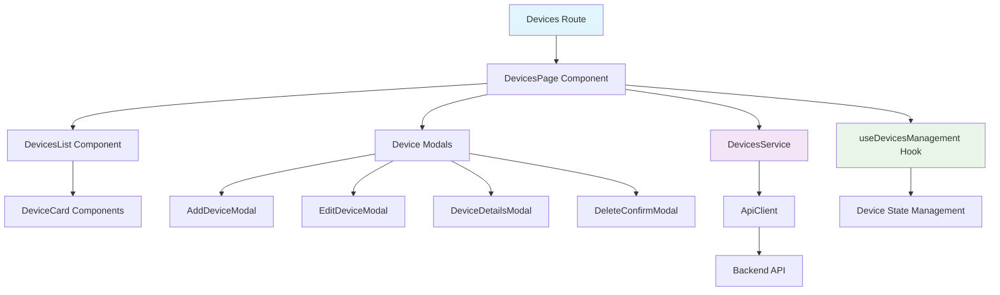

# Design Document

## Overview

The devices management module is a comprehensive React-based interface that enables users to manage their IoT aquarium monitoring devices. The module follows a feature-driven architecture with clear separation of concerns, integrating seamlessly with the existing dashboard design patterns and API infrastructure.

The design leverages the existing `apiClient` for all HTTP communications, maintains consistency with the current UI component library, and implements a user-centered approach with modal-based interactions rather than traditional table views.

## Architecture

### High-Level Architecture



### Feature Structure

```
src/features/devices/
├── components/
│   ├── DeviceCard.tsx              # Enhanced device card with management actions
│   ├── DevicesList.tsx             # Main devices listing with pagination
│   ├── modals/
│   │   ├── AddDeviceModal.tsx      # Device creation/pairing modal
│   │   ├── EditDeviceModal.tsx     # Device editing modal
│   │   ├── DeviceDetailsModal.tsx  # Device details view modal
│   │   └── DeleteConfirmModal.tsx  # Deletion confirmation modal
│   └── forms/
│       ├── DeviceForm.tsx          # Reusable device form component
│       └── AquariumSizeInput.tsx   # Custom aquarium size input
├── hooks/
│   ├── useDevicesManagement.ts     # Main devices management hook
│   ├── useDevicePagination.ts      # Pagination and search logic
│   └── useDeviceActions.ts         # CRUD operations hook
├── services/
│   └── devicesService.ts           # API service layer
├── types/
│   └── index.ts                    # TypeScript interfaces
└── utils/
    ├── deviceValidation.ts         # Form validation utilities
    └── deviceFormatters.ts         # Data formatting utilities
```

## Components and Interfaces

### Core Components

#### DevicesPage Component
- **Purpose**: Main page component that orchestrates the entire devices management interface
- **Responsibilities**:
  - Manages global state for modals and selected devices
  - Handles pagination and search state
  - Coordinates between child components
  - Provides loading and error states

#### DevicesList Component
- **Purpose**: Displays paginated list of device cards with search functionality
- **Features**:
  - Search input with debounced filtering
  - Pagination controls
  - Loading skeletons
  - Empty state handling
  - Responsive grid layout

#### Enhanced DeviceCard Component
- **Purpose**: Extends existing DeviceCard with management actions
- **New Features**:
  - Click handler for device details
  - Management action buttons (Edit, Delete)
  - Consistent with existing design patterns
  - Status indicators and sensor data display

#### Modal Components

**AddDeviceModal**
- Form-based device creation with validation
- Custom aquarium size input (L x W x H format)
- Error handling and success feedback
- Integration with device pairing API

**EditDeviceModal**
- Pre-populated form with current device data
- Same validation as creation form
- Optimistic updates with rollback on failure

**DeviceDetailsModal**
- Comprehensive device information display
- Real-time sensor data (if online)
- Connection history and status
- Quick access to edit/delete actions

**DeleteConfirmModal**
- Confirmation dialog with device information
- Warning about data loss
- Async deletion with loading states

### Data Models

#### Device Interface (Enhanced)
```typescript
interface Device {
  id: string;
  device_id: string;
  device_name: string;
  location?: string;
  aquarium_size?: string;
  glass_type?: string;
  fish_count?: number;
  last_seen: string;
  is_active: boolean;
  created_at: string;
  updated_at?: string;
  user?: {
    id: string;
    name: string;
  };
  online: boolean;
  latestSensorData?: SensorData;
}
```

#### Device Form Data
```typescript
interface DeviceFormData {
  device_id: string;
  device_name: string;
  location: string;
  aquarium_size: {
    length: number;
    width: number;
    height: number;
  };
  glass_type?: string;
  fish_count?: number;
}
```

#### Pagination State
```typescript
interface PaginationState {
  page: number;
  limit: number;
  total: number;
  totalPages: number;
  search: string;
}
```

### Service Layer

#### DevicesService
```typescript
class DevicesService {
  // GET /devices with pagination and search
  async getDevices(params: GetDevicesParams): Promise<DevicesResponse>
  
  // POST /devices - Create new device
  async createDevice(data: CreateDeviceData): Promise<Device>
  
  // GET /devices/{id} - Get device details
  async getDevice(id: string): Promise<Device>
  
  // PATCH /devices/{id} - Update device
  async updateDevice(id: string, data: UpdateDeviceData): Promise<Device>
  
  // DELETE /devices/{id} - Delete device
  async deleteDevice(id: string): Promise<void>
}
```

## Data Models

### API Integration

#### Request/Response Formats

**GET /devices**
- Query Parameters: `page`, `limit`, `search`
- Response: Paginated device list with metadata
- Caching: Client-side caching with 30-second TTL

**POST /devices**
- Request Body: Device creation data with formatted aquarium_size
- Response: Created device object
- Validation: Client and server-side validation

**PATCH /devices/{id}**
- Request Body: Partial device update data
- Response: Updated device object
- Optimistic Updates: UI updates immediately, rolls back on error

### State Management

#### useDevicesManagement Hook
```typescript
interface UseDevicesManagementReturn {
  // Data
  devices: Device[];
  pagination: PaginationState;
  selectedDevice: Device | null;
  
  // Loading States
  loading: boolean;
  actionLoading: boolean;
  
  // Error States
  error: string | null;
  
  // Actions
  fetchDevices: (params?: FetchParams) => Promise<void>;
  createDevice: (data: DeviceFormData) => Promise<void>;
  updateDevice: (id: string, data: DeviceFormData) => Promise<void>;
  deleteDevice: (id: string) => Promise<void>;
  
  // UI State
  setSelectedDevice: (device: Device | null) => void;
  setPagination: (pagination: Partial<PaginationState>) => void;
  clearError: () => void;
}
```

## Error Handling

### Error Categories

1. **Network Errors**: Connection failures, timeouts
2. **Validation Errors**: Form validation, API validation responses
3. **Authorization Errors**: Token expiration, insufficient permissions
4. **Conflict Errors**: Duplicate device IDs, constraint violations
5. **Server Errors**: Internal server errors, service unavailable

### Error Handling Strategy

#### Client-Side Validation
- Real-time form validation using react-hook-form
- Custom validation rules for device IDs and aquarium dimensions
- User-friendly error messages with specific guidance

#### API Error Handling
- Centralized error handling in service layer
- Automatic retry for transient network errors
- User notification system for persistent errors
- Graceful degradation for offline scenarios

#### Error Recovery
- Optimistic updates with automatic rollback
- Retry mechanisms for failed operations
- Clear error messages with actionable suggestions
- Fallback UI states for error scenarios

## Testing Strategy

### Unit Testing

#### Component Testing
- Modal component behavior and state management
- Form validation and submission logic
- Device card interactions and display logic
- Hook functionality and state transitions

#### Service Testing
- API integration with mocked responses
- Error handling and retry logic
- Data transformation and formatting
- Caching behavior and invalidation

### Integration Testing

#### User Flow Testing
- Complete device creation workflow
- Device editing and deletion flows
- Search and pagination functionality
- Error scenarios and recovery

#### API Integration Testing
- Real API endpoint testing in development
- Response format validation
- Error response handling
- Authentication and authorization flows

### End-to-End Testing

#### Critical User Journeys
- New user device pairing process
- Device management operations
- Search and filtering functionality
- Mobile responsive behavior

## Performance Considerations

### Optimization Strategies

#### Data Loading
- Pagination to limit initial data load
- Debounced search to reduce API calls
- Client-side caching with appropriate TTL
- Optimistic updates for better perceived performance

#### Component Optimization
- React.memo for expensive components
- useMemo for computed values
- useCallback for stable function references
- Lazy loading for modal components

#### Bundle Optimization
- Code splitting at feature level
- Dynamic imports for modal components
- Tree shaking for unused utilities
- Optimized asset loading

### Monitoring and Metrics

#### Performance Metrics
- Page load time and time to interactive
- API response times and error rates
- User interaction response times
- Bundle size and loading performance

## Security Considerations

### Data Protection
- Secure token handling through existing apiClient
- Input sanitization and validation
- XSS prevention in user-generated content
- CSRF protection through API design

### Access Control
- Device ownership validation
- User-scoped device access
- Secure device ID generation
- Audit logging for device operations

## Accessibility

### WCAG Compliance
- Keyboard navigation for all interactive elements
- Screen reader support with proper ARIA labels
- Color contrast compliance for status indicators
- Focus management in modal interactions

### Responsive Design
- Mobile-first responsive layout
- Touch-friendly interactive elements
- Readable text sizes across devices
- Optimized modal behavior on mobile

## Migration Strategy

### Existing Code Integration
- Reuse existing DeviceCard component with enhancements
- Maintain compatibility with current device data structure
- Preserve existing styling and design patterns
- Gradual migration of device-related functionality

### Backward Compatibility
- Maintain existing API contracts
- Support legacy device data formats
- Preserve existing user workflows
- Incremental feature rollout capability