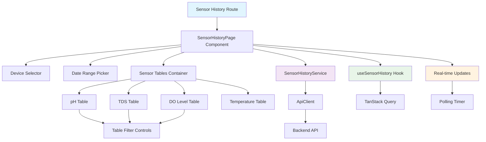

# Design Document

## Overview

Modul sensor data history adalah antarmuka berbasis React yang memungkinkan pengguna untuk melihat dan menganalisis data historis sensor dari perangkat IoT akuarium mereka. Modul ini mengikuti arsitektur feature-driven dengan pemisahan concerns yang jelas, terintegrasi dengan pola desain dashboard yang ada dan infrastruktur API.

Desain ini memanfaatkan TanStack Query untuk data fetching dan caching, TanStack Table untuk tabel yang powerful, dan shadcn/ui components untuk konsistensi UI. Fitur ini berfokus pada user experience yang optimal dengan real-time updates dan filtering yang intuitif.

## Architecture

### High-Level Architecture



### Feature Structure

```
src/features/sensor-data/
├── components/
│   ├── SensorHistoryPage.tsx           # Main page component
│   ├── DeviceSelector.tsx              # Device selection dropdown
│   ├── DateRangePicker.tsx             # Date range selection
│   ├── SensorTablesContainer.tsx       # Container for all sensor tables
│   ├── tables/
│   │   ├── SensorTable.tsx             # Generic sensor table component
│   │   ├── PHTable.tsx                 # pH specific table
│   │   ├── TDSTable.tsx                # TDS specific table
│   │   ├── DOTable.tsx                 # DO Level specific table
│   │   └── TemperatureTable.tsx        # Temperature specific table
│   ├── filters/
│   │   ├── DataTypeFilter.tsx          # Raw/Voltage/Calibrated filter
│   │   └── PageSizeSelector.tsx        # Page size selection
│   └── status/
│       ├── ConnectionStatus.tsx        # Real-time connection indicator
│       ├── LoadingStates.tsx           # Loading skeletons
│       └── EmptyStates.tsx             # Empty data states
├── hooks/
│   ├── useSensorHistory.ts             # Main sensor history hook
│   ├── useDeviceSelection.ts           # Device selection logic
│   ├── useDateRange.ts                 # Date range management
│   ├── useRealTimeUpdates.ts           # Real-time polling logic
│   └── useSensorTableData.ts           # Table data processing
├── services/
│   └── sensorHistoryService.ts         # API service layer
├── types/
│   └── index.ts                        # TypeScript interfaces
└── utils/
    ├── sensorDataFormatters.ts         # Data formatting utilities
    ├── tableHelpers.ts                 # Table utility functions
    └── dateHelpers.ts                  # Date manipulation utilities
```

## Components and Interfaces

### Core Components

#### SensorHistoryPage Component
- **Purpose**: Main orchestrator component untuk seluruh fitur sensor history
- **Responsibilities**:
  - Mengelola state global untuk device selection, date range, dan real-time updates
  - Mengkoordinasikan antara child components
  - Menangani loading dan error states
  - Mengatur polling untuk real-time updates

#### DeviceSelector Component
- **Purpose**: Dropdown untuk memilih perangkat
- **Features**:
  - Fetch daftar perangkat dari API
  - Search functionality dalam dropdown
  - Display device name dan device_id
  - Loading state saat fetch devices
  - Error handling jika gagal load devices

#### DateRangePicker Component
- **Purpose**: Komponen untuk memilih rentang tanggal menggunakan shadcn date picker
- **Features**:
  - Preset options (7 hari terakhir, 30 hari terakhir, dll)
  - Custom date range selection
  - Validation untuk rentang tanggal yang valid
  - Integration dengan URL state untuk persistence

#### SensorTablesContainer Component
- **Purpose**: Container yang mengatur layout dan koordinasi antara tabel sensor
- **Features**:
  - Responsive grid layout untuk 4 tabel
  - Shared loading states
  - Error boundary untuk individual tables
  - Koordinasi real-time updates

#### SensorTable Component (Generic)
- **Purpose**: Komponen tabel generic yang dapat dikustomisasi untuk berbagai jenis sensor
- **Features**:
  - TanStack Table integration
  - Pagination controls
  - Page size selection
  - Column filtering
  - Sorting functionality
  - Loading skeletons
  - Empty states

### Specialized Table Components

#### PHTable, TDSTable, DOTable Components
- **Shared Features**:
  - Data type filter (Raw, Voltage, Calibrated)
  - Status indicator dengan color coding
  - Timestamp formatting
  - Icon untuk jenis sensor
  - Responsive column layout

#### TemperatureTable Component
- **Unique Features**:
  - Simplified layout (hanya value dan status)
  - Tidak ada data type filter
  - Temperature unit display (°C)

### Data Models

#### Sensor Data Interface
```typescript
interface SensorReading {
  time: string;
  timestamp: string;
  device_id: string;
  temperature: {
    value: number;
    status: 'GOOD' | 'BAD';
  };
  ph: {
    raw: number;
    status: 'GOOD' | 'BAD';
    voltage: number;
    calibrated: number;
    calibrated_ok: boolean;
  };
  tds: {
    raw: number;
    status: 'GOOD' | 'BAD';
    voltage: number;
    calibrated: number;
    calibrated_ok: boolean;
  };
  do_level: {
    raw: number;
    status: 'GOOD' | 'BAD';
    voltage: number;
    calibrated: number;
    calibrated_ok: boolean;
  };
}
```

#### API Response Interface
```typescript
interface SensorHistoryResponse {
  status: 'success' | 'error';
  data: SensorReading[];
  metadata: {
    timestamp: string;
    path: string;
    executionTime: number;
  };
}
```

#### Table Configuration Interface
```typescript
interface TableConfig {
  sensorType: 'ph' | 'tds' | 'do_level' | 'temperature';
  columns: ColumnDef[];
  filterOptions?: ('raw' | 'voltage' | 'calibrated')[];
  icon: React.ComponentType;
  title: string;
  color: string;
}
```

#### Filter State Interface
```typescript
interface FilterState {
  deviceId: string | null;
  dateRange: {
    from: Date;
    to: Date;
  };
  dataType: {
    ph: 'raw' | 'voltage' | 'calibrated';
    tds: 'raw' | 'voltage' | 'calibrated';
    do_level: 'raw' | 'voltage' | 'calibrated';
  };
  pagination: {
    page: number;
    limit: number;
  };
}
```

### Service Layer

#### SensorHistoryService
```typescript
class SensorHistoryService {
  // GET /sensors/{deviceId}/history
  async getSensorHistory(params: {
    deviceId: string;
    page: number;
    limit: number;
    from: string;
    to: string;
    orderBy: 'ASC' | 'DESC';
  }): Promise<SensorHistoryResponse>
  
  // GET /devices - untuk device selector
  async getDevices(): Promise<Device[]>
}
```

## Data Models

### API Integration

#### Request Parameters
- `deviceId`: ID perangkat yang dipilih
- `page`: Nomor halaman untuk pagination
- `limit`: Jumlah data per halaman
- `from`: Tanggal mulai dalam format ISO 8601
- `to`: Tanggal akhir dalam format ISO 8601
- `orderBy`: Urutan data (DESC untuk terbaru dulu)

#### Response Caching Strategy
- Cache duration: 30 detik untuk data historis
- Real-time polling: Setiap 30 detik untuk data terbaru
- Invalidation: Saat device atau date range berubah

### State Management

#### useSensorHistory Hook
```typescript
interface UseSensorHistoryReturn {
  // Data
  sensorData: SensorReading[];
  devices: Device[];
  
  // Filter State
  selectedDevice: Device | null;
  dateRange: { from: Date; to: Date };
  dataTypeFilters: DataTypeFilters;
  
  // UI State
  loading: boolean;
  error: string | null;
  isRealTimeActive: boolean;
  
  // Actions
  setSelectedDevice: (device: Device | null) => void;
  setDateRange: (range: { from: Date; to: Date }) => void;
  setDataTypeFilter: (sensor: string, type: string) => void;
  refetch: () => Promise<void>;
  
  // Real-time
  startRealTimeUpdates: () => void;
  stopRealTimeUpdates: () => void;
}
```

## Error Handling

### Error Categories

1. **Network Errors**: Connection failures, API timeouts
2. **Data Errors**: Invalid response format, missing data
3. **Validation Errors**: Invalid date ranges, device selection
4. **Real-time Errors**: Polling failures, connection issues

### Error Handling Strategy

#### User-Friendly Error Messages (Indonesian)
```typescript
const ERROR_MESSAGES = {
  NETWORK_ERROR: 'Koneksi bermasalah. Silakan coba lagi.',
  DEVICE_NOT_FOUND: 'Perangkat tidak ditemukan.',
  INVALID_DATE_RANGE: 'Rentang tanggal tidak valid.',
  NO_DATA_AVAILABLE: 'Tidak ada data untuk periode yang dipilih.',
  REAL_TIME_DISCONNECTED: 'Koneksi real-time terputus. Mencoba menyambung kembali...'
};
```

#### Error Recovery Mechanisms
- Automatic retry untuk network errors
- Fallback ke cached data saat real-time gagal
- Graceful degradation untuk partial data failures
- Clear error messages dengan action buttons

## Testing Strategy

### Unit Testing

#### Component Testing
- Table rendering dengan berbagai data states
- Filter functionality dan state management
- Date range picker behavior
- Device selector interactions

#### Hook Testing
- Data fetching dan caching logic
- Real-time polling behavior
- Filter state management
- Error handling scenarios

### Integration Testing

#### User Flow Testing
- Complete workflow dari device selection hingga data display
- Filter combinations dan interactions
- Real-time updates behavior
- Pagination dan data loading

#### API Integration Testing
- Sensor history endpoint dengan berbagai parameters
- Error response handling
- Data transformation dan formatting

## Performance Considerations

### Optimization Strategies

#### Data Loading
- Pagination untuk mengurangi data load
- Intelligent caching dengan TanStack Query
- Debounced filtering untuk mengurangi API calls
- Virtual scrolling untuk large datasets

#### Component Optimization
- React.memo untuk table components
- useMemo untuk computed table data
- useCallback untuk stable function references
- Lazy loading untuk table components

#### Real-time Updates
- Efficient polling dengan backoff strategy
- Pause polling saat tab tidak aktif
- Incremental updates untuk new data
- Connection status monitoring

### Bundle Optimization
- Code splitting untuk sensor data feature
- Dynamic imports untuk table components
- Tree shaking untuk unused utilities
- Optimized icon loading

## Security Considerations

### Data Protection
- Secure API token handling
- Input sanitization untuk filter parameters
- XSS prevention dalam data display
- Rate limiting untuk API calls

### Access Control
- Device-scoped data access
- User authentication validation
- Secure date range validation
- Audit logging untuk data access

## Accessibility

### WCAG Compliance
- Keyboard navigation untuk semua controls
- Screen reader support dengan proper ARIA labels
- Color contrast compliance untuk status indicators
- Focus management dalam table interactions

### Responsive Design
- Mobile-first table layout
- Touch-friendly filter controls
- Readable data display pada semua ukuran layar
- Optimized pagination untuk mobile

## Real-time Updates Architecture

### Polling Strategy
```typescript
interface PollingConfig {
  interval: number; // 30 seconds default
  maxRetries: number; // 3 retries
  backoffMultiplier: number; // 1.5x backoff
  pauseOnInactive: boolean; // Pause when tab inactive
}
```

### Connection Management
- Automatic reconnection pada network failures
- Visual indicators untuk connection status
- Graceful degradation saat real-time tidak tersedia
- User control untuk enable/disable real-time updates

## UI/UX Design Patterns

### Visual Hierarchy
- Clear section separation untuk setiap sensor type
- Consistent color coding untuk status indicators
- Proper spacing dan typography
- Icon usage untuk quick recognition

### Interaction Patterns
- Consistent filter controls across tables
- Intuitive pagination controls
- Clear loading states dan feedback
- Responsive hover dan focus states

### Indonesian Localization
- Semua text dalam bahasa Indonesia
- Proper date/time formatting untuk Indonesia
- Cultural appropriate error messages
- Consistent terminology usage